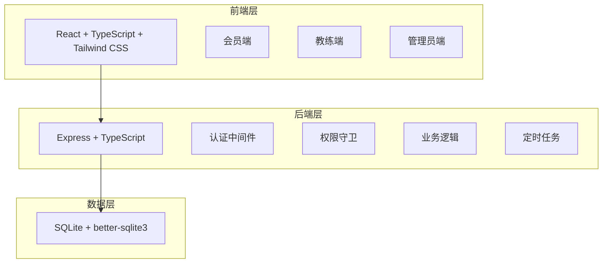
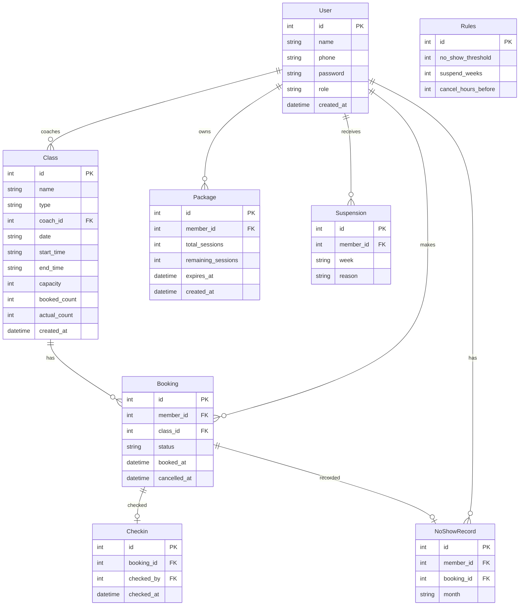

## 1. 架构设计



## 2. 技术说明

- 前端：React@18 + TypeScript + Tailwind CSS@3 + Vite
- 初始化工具：vite-init
- 后端：Express@4 + TypeScript（ESM格式）
- 数据库：SQLite（better-sqlite3），无需外部数据库服务
- 状态管理：Zustand
- 路由：react-router-dom
- 图表：recharts
- 二维码：qrcode（生成） + jsqr（解析）
- 导出：csv-stringify
- 认证：JWT（jsonwebtoken）

## 3. 路由定义

| 路由 | 用途 | 权限 |
|------|------|------|
| `/login` | 登录页 | 公开 |
| `/member/schedule` | 会员-课表浏览 | 会员 |
| `/member/booking/:id` | 会员-预约详情 | 会员 |
| `/member/profile` | 会员-个人中心 | 会员 |
| `/member/records` | 会员-预约记录 | 会员 |
| `/member/qrcode` | 会员-签到二维码 | 会员 |
| `/coach/classes` | 教练-课程列表 | 教练 |
| `/coach/checkin/:id` | 教练-扫码核销 | 教练 |
| `/coach/attendance/:id` | 教练-到场人数录入 | 教练 |
| `/admin/classes` | 管理员-课程管理 | 管理员 |
| `/admin/coaches` | 管理员-教练管理 | 管理员 |
| `/admin/stats` | 管理员-运营统计 | 管理员 |
| `/admin/rules` | 管理员-规则设置 | 管理员 |
| `/admin/reports` | 管理员-报表导出 | 管理员 |

## 4. API 定义

### 4.1 认证相关

```typescript
POST /api/auth/login
  Request: { phone: string; password: string }
  Response: { token: string; user: { id: number; name: string; role: "member" | "coach" | "admin" } }

GET /api/auth/me
  Response: { id: number; name: string; role: string; phone: string }
```

### 4.2 课程相关

```typescript
GET /api/classes?week=2026-06-15&type=yoga
  Response: Class[]

POST /api/classes
  Request: { name: string; type: string; coachId: number; startTime: string; endTime: string; capacity: number; date: string }
  Response: Class

PUT /api/classes/:id
  Request: Partial<Class>
  Response: Class

DELETE /api/classes/:id
  Response: { success: boolean }
```

### 4.3 预约相关

```typescript
POST /api/bookings
  Request: { classId: number }
  Response: Booking

DELETE /api/bookings/:id
  Response: { success: boolean }

GET /api/bookings/my?status=upcoming
  Response: Booking[]

GET /api/bookings/class/:classId
  Response: Booking[]
```

### 4.4 签到核销

```typescript
POST /api/checkins
  Request: { bookingId: number }
  Response: { success: boolean }

GET /api/checkins/scan?memberId=123&classId=456
  Response: { booking: Booking; member: Member }

POST /api/attendance/:classId
  Request: { actualCount: number }
  Response: { success: boolean; attendanceRate: number }
```

### 4.5 会员课时

```typescript
GET /api/members/my/packages
  Response: Package[]

GET /api/members/my/records?from=2026-01-01&to=2026-06-30
  Response: Record[]

GET /api/members/my/records/export?from=2026-01-01&to=2026-06-30
  Response: CSV File
```

### 4.6 统计与报表

```typescript
GET /api/stats/attendance
  Response: { classTypes: { type: string; rate: number; isWarning: boolean }[] }

GET /api/stats/no-shows?month=2026-06
  Response: { memberId: number; name: string; count: number; isSuspended: boolean }[]

GET /api/stats/coaches
  Response: { coachId: number; name: string; classCount: number; avgAttendance: number }[]

GET /api/reports/monthly?month=2026-06
  Response: CSV File
```

### 4.7 规则设置

```typescript
GET /api/rules
  Response: { noShowThreshold: number; suspendWeeks: number; cancelHoursBefore: number }

PUT /api/rules
  Request: { noShowThreshold: number; suspendWeeks: number; cancelHoursBefore: number }
  Response: Rules
```

## 5. 服务器架构图


## 6. 数据模型

### 6.1 数据模型定义



### 6.2 数据定义语言

```sql
CREATE TABLE users (
  id INTEGER PRIMARY KEY AUTOINCREMENT,
  name TEXT NOT NULL,
  phone TEXT NOT NULL UNIQUE,
  password TEXT NOT NULL,
  role TEXT NOT NULL CHECK(role IN ('member', 'coach', 'admin')),
  created_at TEXT NOT NULL DEFAULT (datetime('now'))
);

CREATE TABLE classes (
  id INTEGER PRIMARY KEY AUTOINCREMENT,
  name TEXT NOT NULL,
  type TEXT NOT NULL CHECK(type IN ('yoga', 'boxing', 'spinning', 'pilates')),
  coach_id INTEGER NOT NULL REFERENCES users(id),
  date TEXT NOT NULL,
  start_time TEXT NOT NULL,
  end_time TEXT NOT NULL,
  capacity INTEGER NOT NULL,
  booked_count INTEGER NOT NULL DEFAULT 0,
  actual_count INTEGER,
  created_at TEXT NOT NULL DEFAULT (datetime('now'))
);

CREATE TABLE bookings (
  id INTEGER PRIMARY KEY AUTOINCREMENT,
  member_id INTEGER NOT NULL REFERENCES users(id),
  class_id INTEGER NOT NULL REFERENCES classes(id),
  status TEXT NOT NULL CHECK(status IN ('booked', 'cancelled', 'completed', 'no_show')) DEFAULT 'booked',
  booked_at TEXT NOT NULL DEFAULT (datetime('now')),
  cancelled_at TEXT,
  UNIQUE(member_id, class_id)
);

CREATE TABLE checkins (
  id INTEGER PRIMARY KEY AUTOINCREMENT,
  booking_id INTEGER NOT NULL REFERENCES bookings(id),
  checked_by INTEGER NOT NULL REFERENCES users(id),
  checked_at TEXT NOT NULL DEFAULT (datetime('now'))
);

CREATE TABLE packages (
  id INTEGER PRIMARY KEY AUTOINCREMENT,
  member_id INTEGER NOT NULL REFERENCES users(id),
  total_sessions INTEGER NOT NULL,
  remaining_sessions INTEGER NOT NULL,
  expires_at TEXT NOT NULL,
  created_at TEXT NOT NULL DEFAULT (datetime('now'))
);

CREATE TABLE no_show_records (
  id INTEGER PRIMARY KEY AUTOINCREMENT,
  member_id INTEGER NOT NULL REFERENCES users(id),
  booking_id INTEGER NOT NULL REFERENCES bookings(id),
  month TEXT NOT NULL
);

CREATE TABLE suspensions (
  id INTEGER PRIMARY KEY AUTOINCREMENT,
  member_id INTEGER NOT NULL REFERENCES users(id),
  week TEXT NOT NULL,
  reason TEXT NOT NULL
);

CREATE TABLE rules (
  id INTEGER PRIMARY KEY AUTOINCREMENT,
  no_show_threshold INTEGER NOT NULL DEFAULT 3,
  suspend_weeks INTEGER NOT NULL DEFAULT 1,
  cancel_hours_before INTEGER NOT NULL DEFAULT 2
);

CREATE INDEX idx_classes_date ON classes(date);
CREATE INDEX idx_classes_type ON classes(type);
CREATE INDEX idx_bookings_member ON bookings(member_id);
CREATE INDEX idx_bookings_class ON bookings(class_id);
CREATE INDEX idx_bookings_status ON bookings(status);
CREATE INDEX idx_no_show_member_month ON no_show_records(member_id, month);
CREATE INDEX idx_packages_member ON packages(member_id);

INSERT INTO rules (no_show_threshold, suspend_weeks, cancel_hours_before) VALUES (3, 1, 2);

INSERT INTO users (name, phone, password, role) VALUES ('管理员', '13800000000', 'admin123', 'admin');
INSERT INTO users (name, phone, password, role) VALUES ('王教练', '13800000001', 'coach123', 'coach');
INSERT INTO users (name, phone, password, role) VALUES ('李教练', '13800000002', 'coach123', 'coach');
INSERT INTO users (name, phone, password, role) VALUES ('张会员', '13800000003', 'member123', 'member');
INSERT INTO users (name, phone, password, role) VALUES ('赵会员', '13800000004', 'member123', 'member');

INSERT INTO packages (member_id, total_sessions, remaining_sessions, expires_at) VALUES (4, 30, 25, '2026-12-31');
INSERT INTO packages (member_id, total_sessions, remaining_sessions, expires_at) VALUES (5, 20, 18, '2026-12-31');
```
